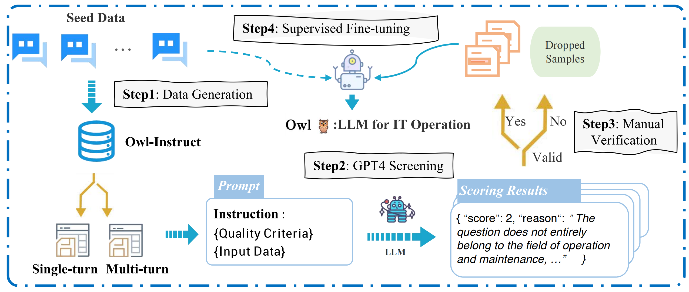

<div align= "center">
    <h1> 🦉🌲OWL</h1>
</div>

<p align="center">  
**Owl: A Large Language Model for IT Operations** <a href="https://arxiv.org/pdf/2309.09298.pdf">Paper</a>
</p>


👋 Welcome, Owl is a large language model designed for AIOps field to handle IT operations related tasks
(fault diagnosis, log analysis, etc). 😊 Owl is an open source project and we welcome everyone to participate and contribute 🌟.


## Abstract

With the rapid advancement of IT operations, managing and analyzing large data volumes efficiently for practical applications has become increasingly critical. Natural Language Processing (NLP) techniques have demonstrated remarkable capabilities in various tasks, 
including named entity recognition, machine translation, and dialogue systems. Recently, Large Language Models (LLMs) have achieved significant improvements across various domain-specific areas. 
However, there is a noticeable gap in the development of specialized Large Language Models (LLMs) tailored for IT operations. In this paper, we introduce the **OWL**,
a large language model trained on our constructed **OWL-Instruct** with a wide range of IT-related information. Specifically, limited by the maximum input length, we propose the **H**omogeneous **M**arkov **C**ontext **E**xtension method (HMCE). The mixture-of-adapter strategy is leveraged to improve the parameter-efficient tuning across different domains or tasks.
Further, we evaluate the performance of **OWL** on the **OWL-Bench** established by us and open IT-related benchmarks. OWL demonstrates superior performance results on IT tasks, which outperforms existing models by significant margins. Moreover, we hope that the findings of our work will provide more insights to revolutionize the techniques of IT operations with specialized LLMs.

## Updated News

Waiting for updates...

## Owl-Instruction



Four phases of constructing **OWL-Instruct** and how we train our **OWL**: (1) Data Generation;  (2) GPT4 Screening; (3) Mannual Verification; and (4) Supervised Fine-tuning.
We provide the bilingual instruction data ([ops001](./OWL-Instruct/data)).

## Owl-Bench
Owl-Bench consist of two parts: [Multiple_Choice](./Multiple_Choice) && [Question_Answer](./Question_Answer).

### Usage

For multiple choice test, please refer to the [MC_readme](./Multiple_Choice/MC_readme.md).
To use question answer test, please refer to the [QA_readme](./Question_Answer/QA_readme.md). Here the example validation data is provided, we will updata it soon.

## Citation

Feel free to cite us if you like Owl.

```bibtex
@article{guo2023owl,
  title={OWL: A Large Language Model for IT Operations},
  author={Guo, Hongcheng and Yang, Jian and Liu, Jiaheng and Yang, Liqun and Chai, Linzheng and Bai, Jiaqi and Peng, Junran and Hu, Xiaorong and Chen, Chao and Zhang, Dongfeng and others},
  journal={arXiv preprint arXiv:2309.09298},
  year={2023}
}
```
