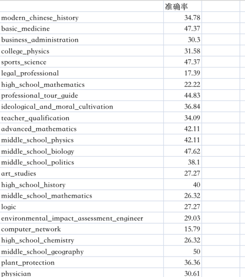
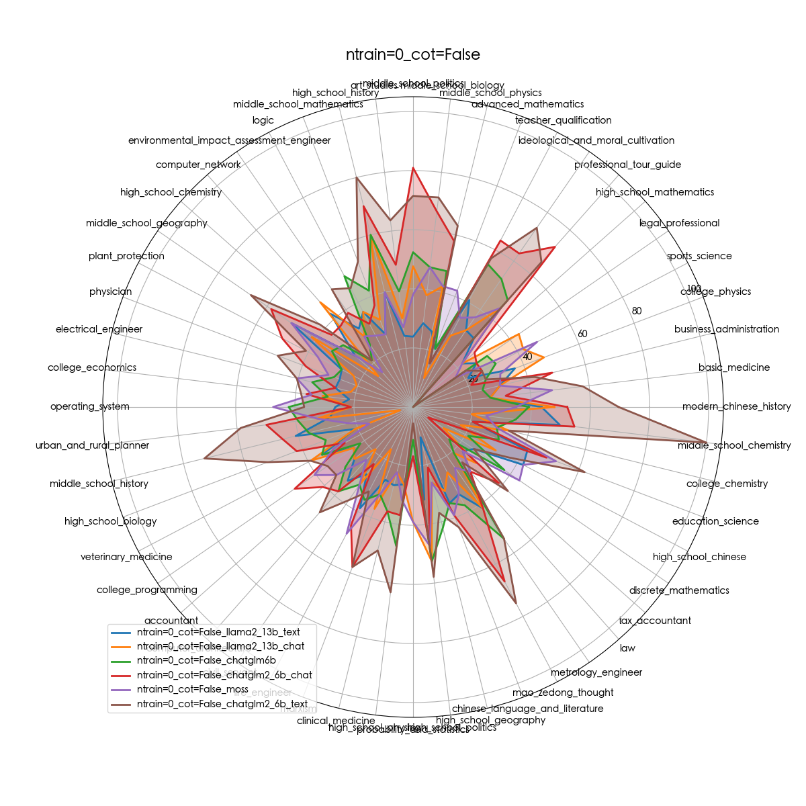
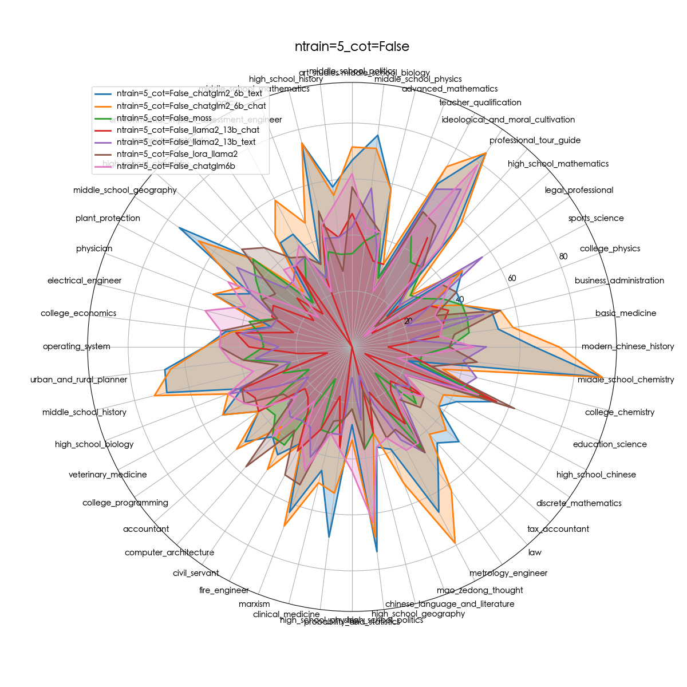
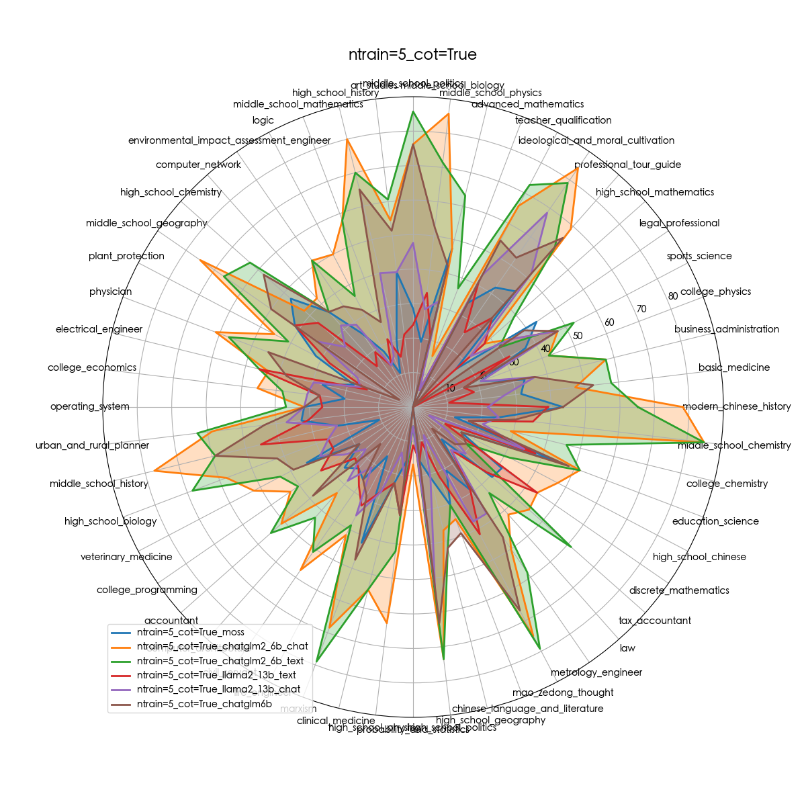
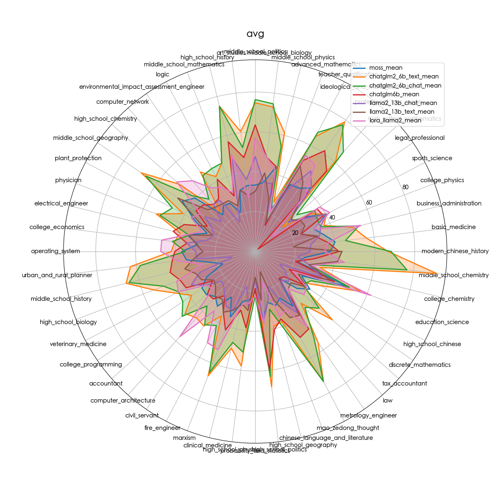
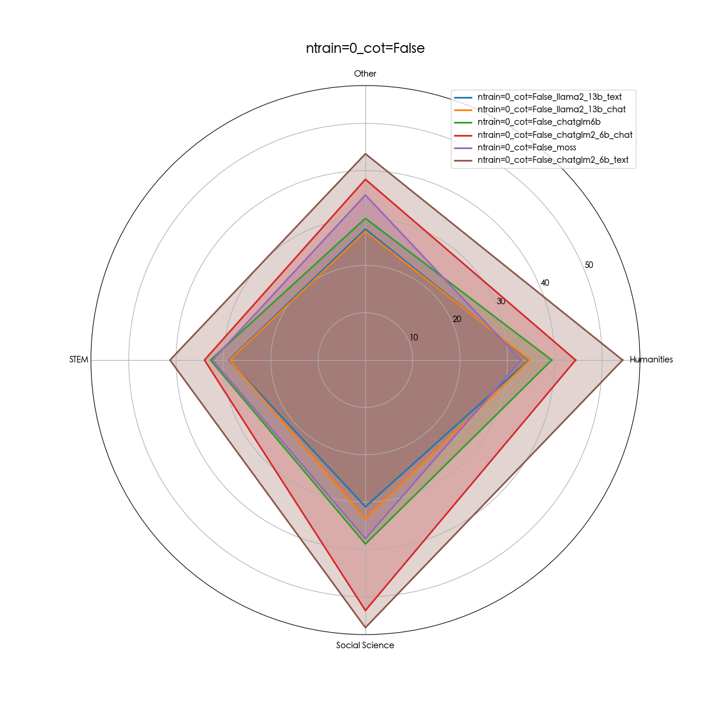
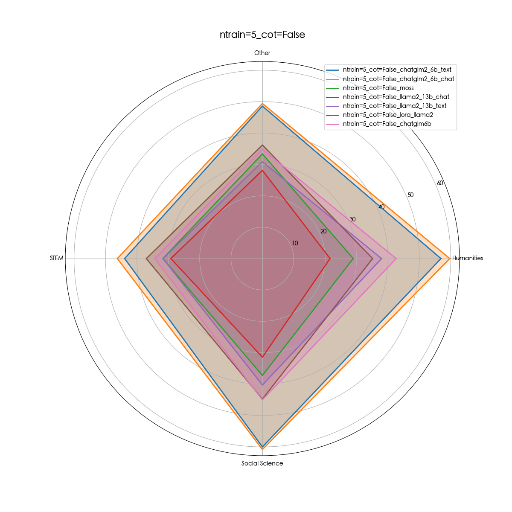
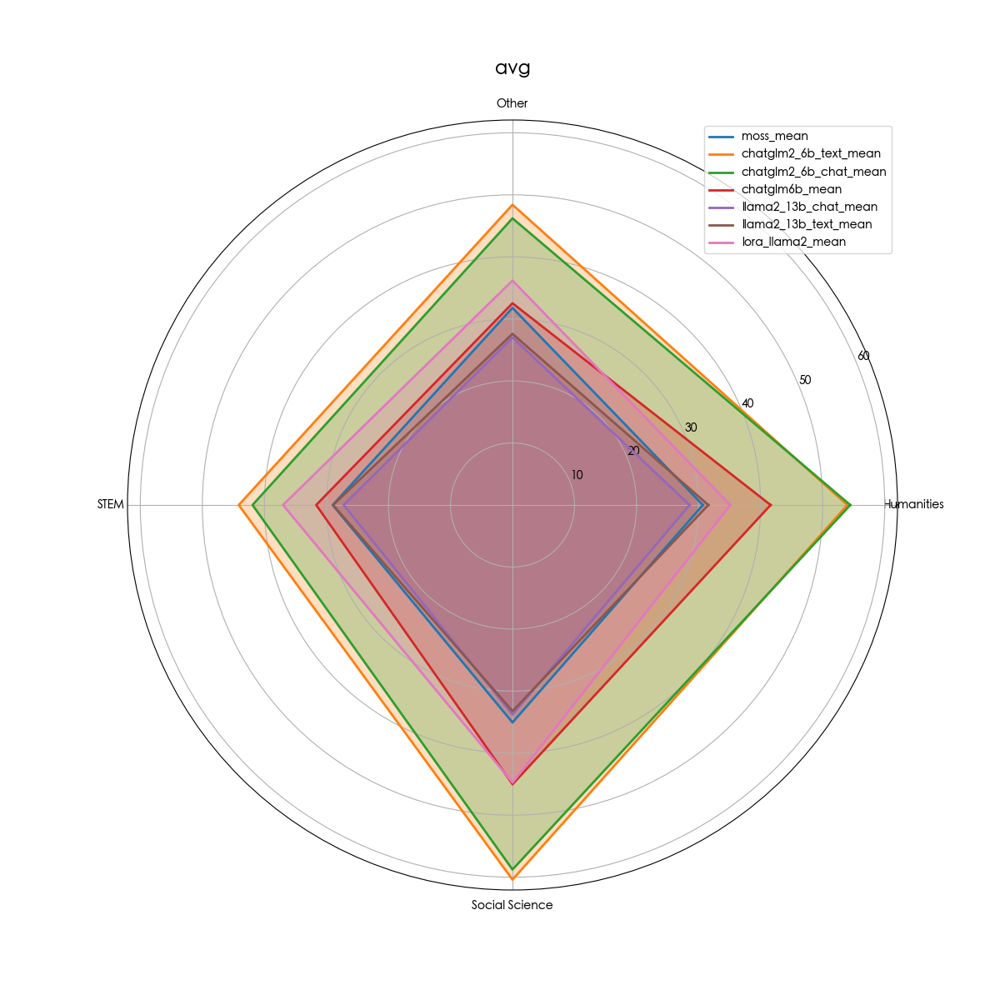

# 结构
- C-Evla
  -  data
  -  model
  -  result
  -  utils
  -  eval_model

## data
  data文件夹是用来保存原始数据的，项目中已经存储好原始数据，无需更改
## model
  该文件夹是用来调用模型的，模型接收指定的输入，输出相应的回答，该文件夹中已有gpt、moss模型的调用
## result 
  该文件夹是用来生成模型对于每个学科的评测结果，包含模型对每个问题的回答以及正确与否
## utils
  存放数据预处理的代码
## eval_model
  这是针对每个模型测评时，调用的主代码（main）
  拿moss模型举例：
  > 包含四个参数：path,ntrain,cot,temperature
  > - path:C-Eval在服务器上的地址
  > - ntrain:few-shot的个数
  > - cot:是否需要思维链，True or False
  > - temperature:控制结果随机性的参数
  > - model_name:#["chatgpt","moss","chatglm6b","chatglm2_6b"]
  > - model_path:模型路径
  > - cuda_visible_device:可用显卡编号
---
# 运行+结果
## 运行
```pytohn
    main(path='/data/semeron/C-Eval', #项目地址
         ntrain=0,
         api_key="",  # if model is chatgpt ,this paarameter is necessary.
         cot=True,
         temperature=0.2,
         model_name="llama_13b",  #["chatgpt","moss","chatglm6b","chatglm2_6b","llama_13b"]
         model_path="/data/models/llama-13B",
         cuda_visible_device="4,5,6,7")
```
## 结果
  会在result文件夹下生成模型对于每个学科的评测结果，包含模型对每个问题的回答以及正确与否，如下图：
  
  
  同时在程序执行完毕后，会C-Eval文件夹下生成模型对数据集各个学科的准确率汇总的csv文件，如下：
  

## 雷达图
  ntrain=0_cot=False
 
 







  

 