# single
## alpaca
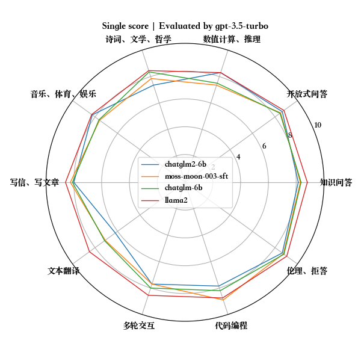
## ops
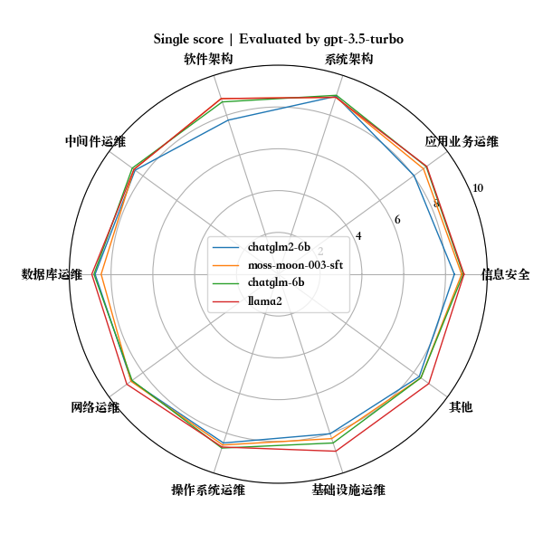
## mt
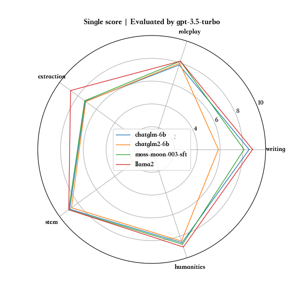

# pairwise
## alpaca
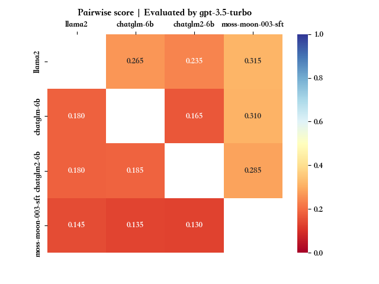
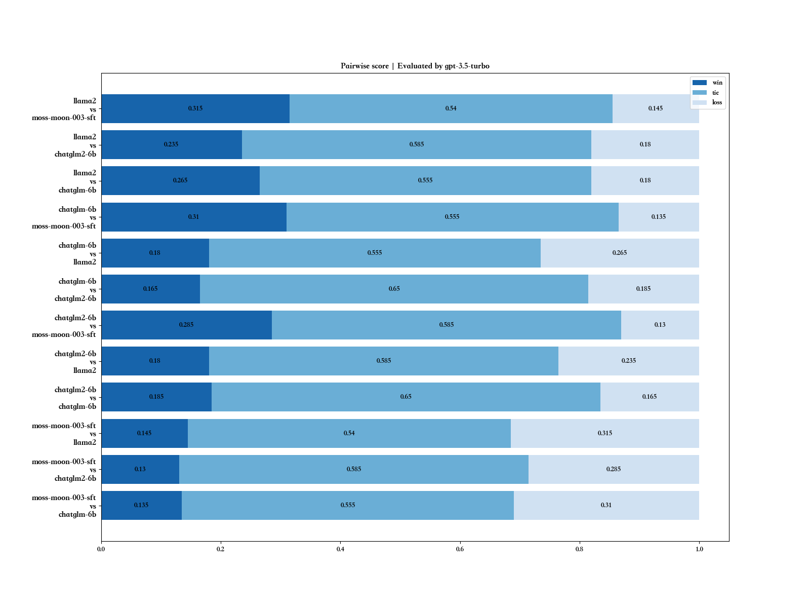
## ops
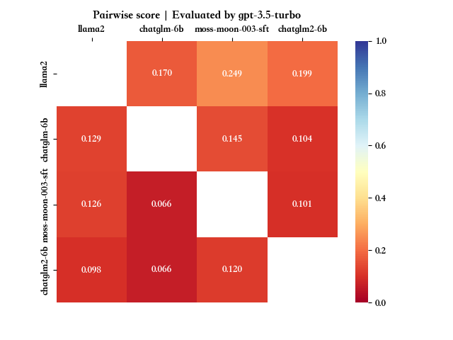
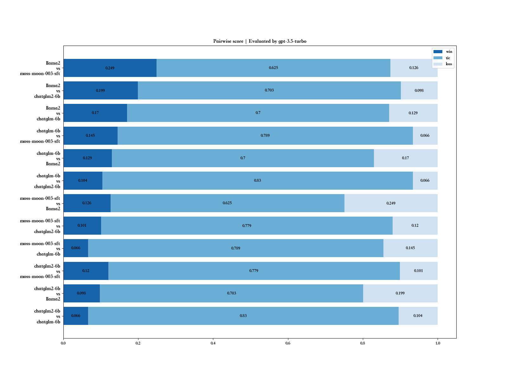
## mt
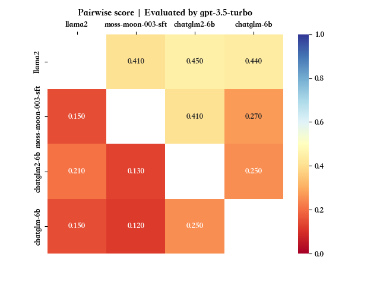
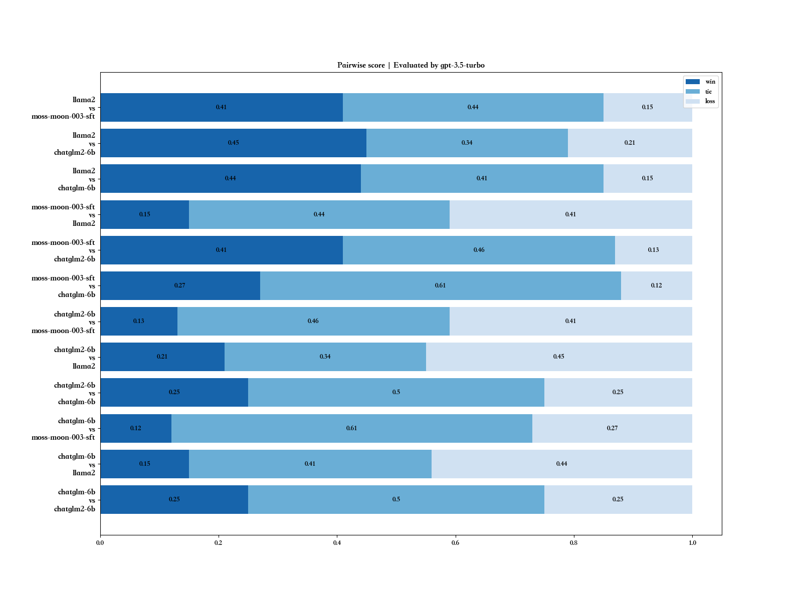

# gpt-3.5-turbo vs gpt-4
测试集：mt_banch中的前3个问题\
（因gpt api调用限制，先粗略评测下; api限制 10,000 tokens per minute (TPM) or 200 requests per minute (RPM)）
## gpt-3.5-turbo
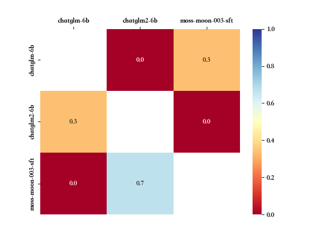
## gpt-4
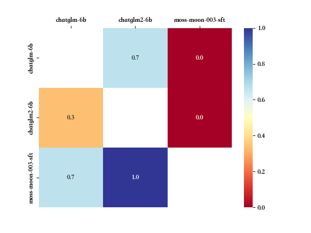
